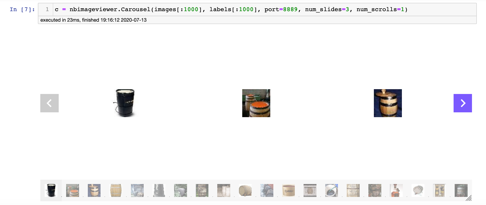

# nbimageviewer

`nbimageviewer` is a Python library for aesthetic and efficient image visualization in Jupyter Notebooks. It uses [IPython](https://ipython.readthedocs.io/en/stable/api/), ReactJS, and WebSockets to efficiently visualize large amounts of images.



Visualizing large amounts of images in a Jupyter Notebook is usually done by creating matplotlib plots, which can be a painful and inefficient process with lots of configuring and searching online.

```
import matplotlib.pyplot as plt
import load_images

images = load_images()
fig, ax = plt.subplots()
for i, image in enumerate(len(images)):
  ax[i] = plt.imshow(image)
  ...
```

`nbimageviewer` simplifies this process while providing convenient and beautiful visualizations.

```
import nbimageviewer.carousel as carousel
import load_images

images = load_images()
c = carousel.Carousel(images)
```

## Installation

To install `nbimageviewer` from PyPI:
```
pip install nbimageviewer
```

To  install `nbimageviewer` from source:
```
git clone git@github.com:briankosw/nbimageviewer.git
cd nbimageviewer
pip install .
```

## Usage
`nbimageviewer` currently supports two ways of visualizing images: `Carousel` and `Gallery`.

### Carousel


### Gallery


## License

Distributed under the MIT License. See [LICENSE.txt](LICENSE.txt) for more information.